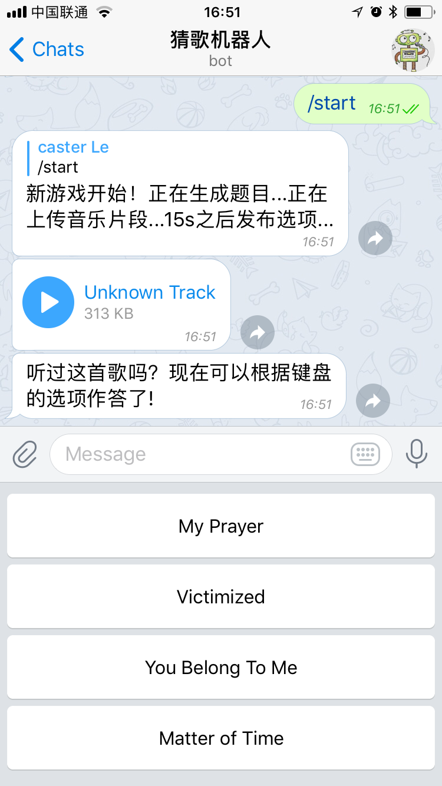

# Telegram 猜歌机器人

一个猜音乐的telegram机器人，音乐文件存储在S3，运行在GCP。




安装：

```
pip install guess_song_bot
```

## 切音乐

S3 变量：

```
export KEY=S3key
expport SECRET=S3secret
BUCKET="telegram-bot"
```

开始：

```
cut_song <song_path>
```

## 运行bot

环境变量:

```
export API_TOKEN=your-bot-token
```


运行：

```
bot_run
```

日志：

```
tail -f tail_log
```
